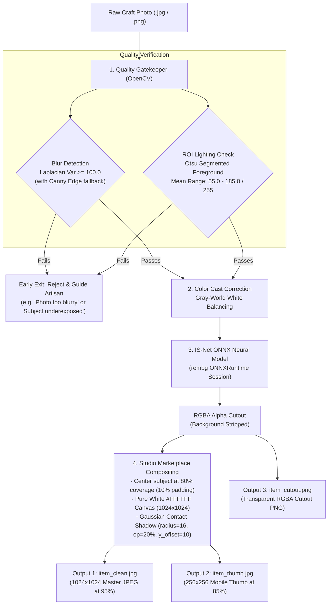
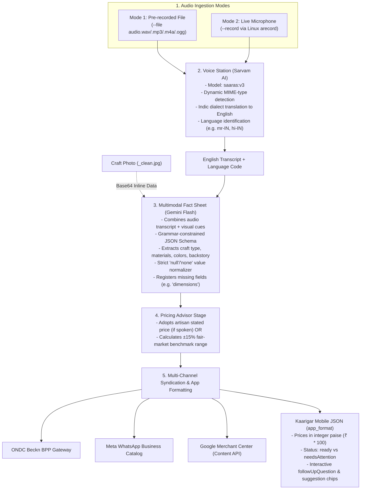

# Kaarigar (SIH-090): Vision & Voice Pipelines Technical Handover
**Author:** Kaustubh Sinha (Vision & Voice Lead)  
**Target:** Engineering Handover / Teammate Reference  
**Branch:** `voice`

---

## 1. Executive Summary

This document provides a comprehensive technical walkthrough of the two core AI stations developed for Kaarigar (SIH-090):
1. **Vision Station (`ImageStation`)**: Takes raw, cluttered smartphone photos from rural artisans and transforms them into e-commerce-ready studio cutouts on a pure white canvas using OpenCV quality gates, Gray-World color restoration, and **IS-Net ONNX deep learning background removal**, producing **3 standardized production assets**.
2. **Voice Station (`VoiceStation` + Multimodal LLM Extraction)**: Ingests Indic audio notes (either live microphone recordings or pre-recorded audio in dialects like Marathi, Hindi, etc.), translates them to English via **Sarvam AI (`saaras:v3`)**, extracts structured e-commerce attributes using **multimodal Gemini Flash** (combining speech and image), calculates fair market price bounds, and outputs the exact JSON consumed by Flutter mobile models and multi-channel syndication adapters (ONDC, WhatsApp Business, Google Shopping).

---

## 2. Vision Pipeline (`ImageStation`)

- **Implementation**: `backend/app/services/vision/pipeline.py`
- **Pipeline Stage**: `backend/app/services/pipeline/stages/image.py`
- **Deep Learning Model**: `isnet-general-use` (Intermediate Supervision Network) via ONNXRuntime.

### 2.1 Processing Flow & Architecture



### 2.2 Detailed Steps

1. **Quality Assessment Gatekeeper**:
   - **Blur Check**: Computes the variance of the Laplacian filter (`cv2.Laplacian(gray, cv2.CV_64F).var()`). If variance $< 100.0$, a Canny edge density fallback verifies whether genuine edges exist.
   - **ROI Lighting Check**: Uses **Otsu's adaptive thresholding** to isolate the craft object from the background and calculates the mean brightness of the craft alone. The safe brightness window is `[55.0, 185.0]` out of 255. Photos outside this window trigger an early exit warning to guide the artisan.
2. **Color Cast Correction**:
   - Implements the **Gray-World Assumption**: Computes channel means ($R_{\text{avg}}, G_{\text{avg}}, B_{\text{avg}}$) and scales RGB channels towards neutral gray to neutralize warm incandescent or tungsten tinting from artisan workshops.
3. **Background Removal via IS-Net ONNX**:
   - The image is passed through the `isnet-general-use` ONNX model session (`rembg.new_session`).
   - The model isolates the handicraft foreground, outputting a 4-channel RGBA mask with soft edge segmentation.
4. **Studio Marketplace Compositing**:
   - Locates the bounding box of foreground pixels (`alpha > 25`).
   - Rescales the craft using Lanczos interpolation to fill **80% of a 1024×1024 canvas** (10% padding).
   - Generates a **soft ground contact shadow** by tinting the alpha mask black, offsetting it vertically (`+10px`), and applying a Gaussian blur (`radius=16`).
   - Merges the shadow and the centered craft cutout onto a pure white background (`RGB 255, 255, 255`).

### 2.3 The 3 Generated Assets & Storage Locations

| File Suffix | Format | Dimensions | Purpose |
| :--- | :--- | :--- | :--- |
| **`{item_id}_clean.jpg`** | JPEG (Quality 95, Optimized) | 1024 × 1024 | **Master Product Asset**: Used for syndication across ONDC, WhatsApp Store, and Google Shopping. |
| **`{item_id}_thumb.jpg`** | JPEG (Quality 85, Lanczos) | 256 × 256 | **Mobile Thumbnail**: Fast-loading asset for mobile listings grids and low-connectivity environments. |
| **`{item_id}_cutout.png`** | PNG (RGBA 32-bit Transparent) | Original Bounding Box | **Transparent Cutout**: Used for promotional marketing, social banners, and AR craft viewing. |

- **CLI / Local outputs**: `backend/generated_assets/`
- **Production outputs**: `backend/storage/media/` or synchronized to Cloud Object Storage (S3 / GCS).

---

## 3. Voice Pipeline (`VoiceStation` & Multimodal Fact Sheet)

- **Implementation**: `backend/app/services/voice/pipeline.py`
- **Multimodal LLM**: `backend/app/services/llm/gemini.py`
- **Pricing Advisor**: `backend/app/services/pipeline/stages/price.py`
- **CLI Driver**: `backend/test_voice_cli.py`

### 3.1 Processing Flow & Architecture



### 3.2 Detailed Steps

1. **Audio Ingestion**:
   - **File Mode**: Ingests `.wav`, `.mp3`, `.m4a`, or `.ogg` audio files.
   - **Microphone Mode**: Uses Linux ALSA (`arecord -d <seconds> -f cd -t wav -r 16000 -c 1`) to capture 16 kHz CD-quality speech directly from the hardware microphone.
2. **Voice Translation Station (Sarvam AI)**:
   - Streams the audio to `https://api.sarvam.ai/speech-to-text-translate` using model `saaras:v3`.
   - Accurately translates regional Indian languages (Hindi, Marathi, Bengali, Tamil, Telugu, Gujarati, Kannada, etc.) into structured English text.
   - Extracts detected `language_code` and speech duration.
3. **Multimodal Fact Sheet Station (Gemini Flash)**:
   - Encodes the craft photograph into base64 inline data and passes it alongside the translated transcript to `gemini-2.0-flash` (or `gemini-3.5-flash`).
   - Uses `generationConfig.response_schema` to guarantee deterministic JSON output without hallucinations.
   - **Value Normalization**: Explicitly normalizes string values like `"null"`, `"None"`, or `"not specified"` into Python `None` so missing data is never rendered as literal text on seller devices.
   - **Missing Field Detection**: Identifies omitted commercial parameters (`missing_fields: ["dimensions", "price"]`).
4. **Pricing Advisor Engine**:
   - If the artisan explicitly stated a price in their voice note (e.g., ₹100), the system adopts it and establishes fair market bounds (`min = stated * 0.90`, `max = stated * 1.15`).
   - If no price is stated, it calculates baseline market bounds and flags `price` in `missing_fields`.
5. **Mobile JSON Output (`app_format`)**:
   - Conforms strictly to the Flutter `Listing` and `FactSheet` schemas in `app/lib/data/models/`.
   - **Integer Paise Representation**: Multiplies INR amounts by 100 (`priceInPaise: 10000` = ₹100.00).
   - **State Machine**: Sets status to `needsAttention` if any required field is missing, generating an interactive voice prompt (`followUpQuestion`) and suggestion chips for seller review.

---

## 4. Quick Verification Commands

Run these commands inside the `backend/` directory:

```bash
# 1. Run the complete automated test suite (160/160 tests - 100% pass)
.venv/bin/pytest tests/

# 2. Test Vision-only (OpenCV + IS-Net background removal)
.venv/bin/python -c "from app.services.vision.pipeline import ImageStation; s = ImageStation(); res = s.process_image('../app/assets/images/crafts/pottery.jpg', 'generated_assets', 'demo_pot'); print('Outputs:', res['outputs'])"

# 3. Test Voice-only (audio file)
.venv/bin/python test_voice_cli.py --file /home/kaustubh/Music/b.wav --output voice_output.json

# 4. Test Live Multimodal (Photo + Voice Note together)
.venv/bin/python test_voice_cli.py --file /home/kaustubh/Music/b.wav --image ../app/assets/images/crafts/pottery.jpg --output app_listing.json

# 5. Test Live Microphone Recording
.venv/bin/python test_voice_cli.py --record --seconds 8 --image ../app/assets/images/crafts/pottery.jpg
```

---

## 5. Security and Robustness Highlights

1. **Path Traversal Guards**: Image and audio file handlers enforce `raw_path.is_relative_to(storage_base)` checks to prevent path traversal attacks (`../../etc/passwd`).
2. **Offline CI/CD Reliability**: When external API keys (`SARVAM_API_KEY`, `GEMINI_API_KEY`) are omitted, both stations execute deterministic synthetic fallbacks, ensuring automated pipelines and test suites pass 100% offline.
3. **Paise Precision**: All price calculations convert decimal rupees into integer paise to prevent IEEE 754 floating point precision errors during e-commerce transactions.
